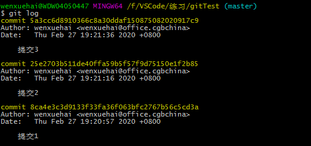

## 1、Gerrit的基本介绍

Gerrit 是一个Git服务器，它基于 git 版本控制系统，使用网页界面来进行审阅工作。Gerrit 旨在提供一个轻量级框架，用于在代码入库之前对每个提交进行审阅，更改将上载到 Gerrit，但实际上并不成为项目的一部分，直到它们被审阅和接受 。代码审查是Gerrit的核心功能，但仍是可选的，团队可以决定不进行代码审查而工作。

Gerrit 是一个临时区域, 在提交的代码成为代码库的一部分之前, 可以对其修改进行检查。代码修改的作者将提交作为对 Gerrit 的更改。在Gerrit中，每个更改都存储在暂存区域中，可以在其中进行检查和查看。仅当它被批准并提交时，它才被应用到代码库中。

其实，Gerrit 就相当于是在开发员将本地修改提交到代码仓库之前的一个审核工具。在这个审核工具中，你可以查看该提交者在本次的的提交中的修改，然后再决定是否可以将该修改提交给仓库。

## 2、Gerrit的页面介绍

### 2.1、CHANGES菜单

点击 changes 可以查看所在项目的所有审批记录，共有三种状态：open、merged、abandoned。

open：还未审核、审核不通过、审核通过还未提交到远程仓库的提交

merged：审核已通过并已提交到远程仓库的提交

abandoned：已取消审核的提交

### 2.2、YOUR -> CHANGES 菜单

点击 your -> changes 可以查看当前登录用户的名下的所有审核记录，包括本人提交和本人需审核的。

outgoing reviews：本人待被审核的提交

incoming reviews：别人提交，本人需要审核的提交

recently closed：已关闭的提交，包括已经推送到远程仓库和已经取消审核的 

### 2.3、Repositories

点击 repositories 可以看到自己有权限看到的所有项目。

点击进入某个项目，可以查看该项目的下载链接，共有三种下载方式：

anonymous http：链接里面无用户名，下载时需输入用户名和密码

http：链接里待用户名，下载时无需输入用户名，但需要输入密码

ssh：免密方式，无需输入用户名和密码，但需将本地生成的公钥保存在 Gerrit 网页中

## 3、在Gerrit上的代码克隆方式

在Gerrit上有三种克隆方式，如上面的 2.3 所示，跟在 github 上克隆代码没什么区别。

在 Gerrit 中，你可以选择 clone with commit-msg hook 选项来进行克隆，该选项在上面的三种克隆方式中都有，该方式会将 Gerrit 上的 commit-msg 脚本拷贝在你的本地仓库中，由此你就可以将代码提交到 Gerrit 中（未验证）。 commit-msg 脚本是使用 Gerrit 的一个非常重要的步骤，不可或缺，后面会介绍。

## 4、Gerrit 上的钩子 commit-msg

commit-msg 是一个脚本文件，该脚本对于 Gerrit 的使用非常重要，使用 Gerrit 必须要有此脚本，否则在本地的修改版本无法提交至 Gerrit 中，会报错：<span style='color: red;'>missing change-id in commmit message footer</span>，表示该版本提交没有 change-id。

commit-msg 脚本文件应该放在代码根目录的 .git/hooks 文件夹下，该文件夹下有许多的脚本文件，这些脚本文件也被称之为钩子，在被特定的事件触发后这些文件将会被调用。当一个 git 仓库被初始化生成时，一些非常有用的钩子脚本将会生成在仓库的 .git/hooks 目录中，但是在默认情况下它们是不生效的，把这些钩子文件的 ”.sample”文件后缀名去掉就可以使它们生效。

Git 提供了4个提交工作流钩子：pre-commit、prepare-commit-msg、commit-msg、post-commit。其中 commit-msg 钩子，会在我们执行 git commit 时被执行。

在 gerrit 的 Change-Id 生成机制中，gerrit 会利用 commit-msg 的钩子，在我们提交代码后，按照一定规则修改提交日志，在其末尾添加了一行Change-Id。

### 4.1、如何给本地仓库添加钩子 commit-msg

#### 4.1.1、在克隆仓库时选择带 commit-msg 的方式进行克隆

 在 Gerrit 中克隆仓库有三种方式，anonymous http、http、ssh，这三种方式当中都有一个 clone with commit-msg hook 选项可供选择，选择该选项的链接来克隆项目，将会自动在你本地的仓库中生成 commit-msg 钩子，这样在你今后的本地提交当中 commit-msg 都会起作用，将会给每个提交自动生成一个 chang-id，保证了你的本地提交可以推送到 Gerrit 中。

#### 4.1.2、在本地仓库直接使用 git 命令来拷贝Gerrit的commit-msg

如果在克隆时选择的不是 clone with commit-msg hook 链接，那么本地的仓库当中的 commit-msg 将不会起作用，你的本地提交不会生成 change-id，也就无法将提交推送至 Gerrit 中。

此时你可以在本地仓库中的根目录下使用下面的 git 命令来拷贝 Gerrit 的 commit-msg：

```shell
scp -p -P 29418 yourName@Gerrit服务器地址:hooks/commit-msg  "hooks文件夹路径"

//实例：
scp -p -P 29418 wenxuehai@21.96.221.111:hooks/commit-msg  ".git/hooks"
```

上面命令表示将 gerrit 的 commit-msg 脚本下载到本地仓库的 t/.git/hooks/ 目录中。执行上面的命令，你的本地仓库的 .git/hooks 文件夹下的 commit-msg 文件将会被 Gerrit 的 commit-msg 文件覆盖掉，由此你今后的提交当中也会自动生成一个 change-id。

## 5、Gerrit 中的 change-id

待完善。

6、如何将本地提交推送至Gerrit中

在 Gerrit 上工作和在 github 上工作的差别不大，两者都是基于 git 版本控制系统的。当我们在本地工作时，除了需要有一个 commit-msg 钩子文件外，其他的并没有区别。

当我们在本地进行了修改，并且进行了 commit 生成了版本后，就可以将本地提交推送至 Gerrit 中，不过推送命令和平常的不太一样：

```shell
git push origin HEAD:refs/for/远程分支名
//实例：
git push origin HEAD:refs/for/2020_branch
```

一旦你在本地完成commit，就需要把他 push 到Gerrit，这样才能被审核者 review，这就需要git push到Gerrit server。

可以看到 HEAD 被推送到 refs/for/2020_branch，这是 2020_branch 的的魔幻分支，用于创建 review。对于每一个分支，Gerrit都会追踪一个魔幻分支refs/for/branchName。

## 7、提交报错

### 7.1、提示：commit xxx：missing change-id in commmit message footer

在将本地修改推送到 Gerrit 上时（请注意往Gerrit上推送必须使用git push origin HEAD:refs/for/branchName命令），有可能会报以上的错误，表示没有 change-id，提示信息还标出了是哪次提交缺少 change-id。

**注意：在将修改推送到 Gerrit 上时，本地每次提交的修改都必须有 change-id，可以使用 git log 命令来查看哪次提交是没有 change-id 的，但凡有一个提交没有chang-id，本地代码都无法推送至 Gerrit 上。**

面对这种情况有以下解决方法：

请注意，下面的解决方法的前提是本地的commit-msg脚本文件已经替换成了Gerrit上的，使用 Gerrit 必须先拷贝commit-msg脚本文件，如果还没有的话请参考4.1.2 先拷贝脚本文件，否则下面的解决方法仍然无法解决问题

#### 7.1.1、标出的缺少 chang-id 的提交就是最近的一次提交

此时一般来说，git 就会提示你需要进行的操作：gitdir=$(git rev-parse .... ${gitdir}/hooks/ ，然后需要： git commit --amend --no-edit，我们只需将 git 提示的命令复制下来操作即可：

```shell
//先执行下面命令，其实下面的命令就是拷贝Gerrit中的commit-msg脚本文件，如果你已经拷贝了的话可以不用执行下面的命令也行
gitdir=$(git rev-parse --git-dir); scp -p -P 29418 yourName@gerrit服务器地址:hooks/commit-msg ${gitdir}/hooks/
//实例：
gitdir=$(git rev-parse --git-dir); scp -p -P 29418 wenxuehai@gerrit21.96.221.111:hooks/commit-msg ${gitdir}/hooks/
 
//再执行
git commit --amend --no-edit
```

#### 7.1.2、缺少 change-id 的提交并不是最近的一次提交

如果缺少 change-id 的提交并不是最近的一次提交的话，上面的解决方法就无法解决问题，因为将修改推送至 Gerrit，必须要求每次提交都有 change-id。

此时我们可以使用 git log 命令来查看是哪次提交没有 change-id，或者 git 提示信息也会标出是哪次提交没有 change-id，然后记下该次提交的下面那个提交的 commit id，即前一次提交的 commit id。

比如下图：



假设上图中，提交2缺少了 change-id，那么我们就需要记下提交1的commit id：8ca4e3c3d9133f33fa36f063bfc2767b56c5cd3a。

然后执行下面的命令：

```shell
git reset --soft 8ca4e3c3d9133f33fa36f063bfc2767b56c5cd3a
//执行完上面的命令后咱们可以查看状态，此时可以看到本地的修改并没有丢失
git status
//然后再照常提交一个版本
git add .
//此时提交过后就可以看到本次提交的版本就会有 change-id 了
git commit -m '提交修改'
 
//然后推送即可
git push origin HEAD:refs/for/branchName
```

如果缺少 change-id 的不止一个提交，这时就需要从最近的一个缺少 change-id 的提交照着上面的操作进行修改，或者直接从最晚的那个缺少 change-id 的提交进行操作？（未尝试过）

## 8、提交成功但在Gerrit上查看显示在merge conflict状态

### 8.1、出现merge conflict的原因

由于有 code review 的存在，有可能出现这种情况：同时有多个人的代码被 review，如果有一个人改了与你相同地方的代码，并且他的代码先通过 review 并被合进了远程代码库。当你的代码通过 review 并进行合并，此时会产生冲突，你的提交也就会显示为 merge conflict 状态。在 Gerrit 网页上的 CHANGES -> open 上就可以看到该冲突提交，该提交无法 submit 到远程仓库上。如果你不解决掉该冲突提交的话，你在本地的之后的提交也无法合并到远程仓库上，因为你本地的提交都是基于前面的那次有冲突的提交的。

### 8.2、解决方法

1）先在 Gerrit 的 CHANGES -> open 上找到该提交，然后点击 ‘ABANDON' 按钮将该提交取消掉。

2）在本地找到该提交的上一个提交版本的 commit id，注意，是比这个出现冲突的版本更早提交的版本，一般来说，这个版本已经提交到了Gerrit上的

3）使用 git reset 的混合模式（git reset --mixed commitId）或者是软模式（git reset --soft commitId）回退至上面记录的 commit id 的版本，使用这两种模式不会丢失你本地的修改，所以大可以放心。

4）使用 git stash 命令将本地修改储存起来，然后再拉取最新代码，拉取完毕后应用储存 git stash pop，如果有冲突就解决冲突即可。然后就可以将版本提交至Gerrit上了。

综上所述，其实出现这种状态主要就是因为你的代码和别人的代码产生了冲突，并且别人的代码先一步通过了 review 而且合并到了仓库当中，而你的代码通过 review 但是无法合并到仓库中，因为两人的修改产生了冲突，此时就要解决冲突。

你只需回退一下版本，然后拉取远程代码，在本地解决冲突，然后就可以将本地版本提交至 Gerrit 上了。


<br/>

**原文地址：**

[Gerrit的基本使用](https://www.cnblogs.com/wenxuehai/p/12357898.html)