## 前言

H264视频压缩算法现在无疑是所有视频压缩技术中使用最广泛，最流行的。随着 x264/openh264以及ffmpeg等开源库的推出，大多数使用者无需再对H264的细节做过多的研究，这大降低了人们使用H264的成本。

但为了用好H264，我们还是要对H264的基本原理弄清楚才行。今天我们就来看看H264的基本原理。

## H264概述

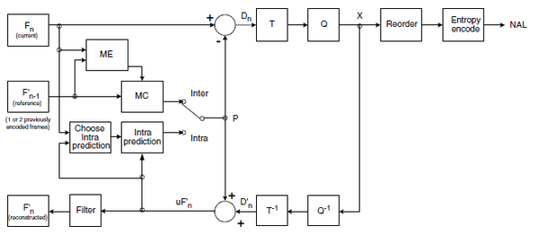

H264压缩技术主要采用了以下几种方法对视频数据进行压缩。包括：

- 帧内预测压缩，解决的是空域数据冗余问题。
- 帧间预测压缩（运动估计与补偿），解决的是时域数据冗徐问题。
- 整数离散余弦变换（DCT），将空间上的相关性变为频域上无关的数据然后进行量化。
- CABAC压缩。

经过压缩后的帧分为：I帧，P帧和B帧:

- I帧：关键帧，采用帧内压缩技术。
- P帧：向前参考帧，在压缩时，只参考前面已经处理的帧。采用帧音压缩技术。
- B帧：双向参考帧，在压缩时，它即参考前而的帧，又参考它后面的帧。采用帧间压缩技术。

除了I/P/B帧外，还有图像序列GOP。

- GOP:两个I帧之间是一个图像序列，在一个图像序列中只有一个I帧。如下图所示：

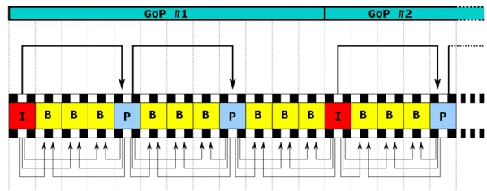

下面我们就来详细描述一下H264压缩技术。

## H264压缩技术

H264的基本原理其实非常简单，下我们就简单的描述一下H264压缩数据的过程。通过摄像头采集到的视频帧（按每秒 30 帧算），被送到 H264 编码器的缓冲区中。编码器先要为每一幅图片划分宏块。

以下面这张图为例:

### 划分宏块

H264默认是使用 16X16 大小的区域作为一个宏块，也可以划分成 8X8 大小。

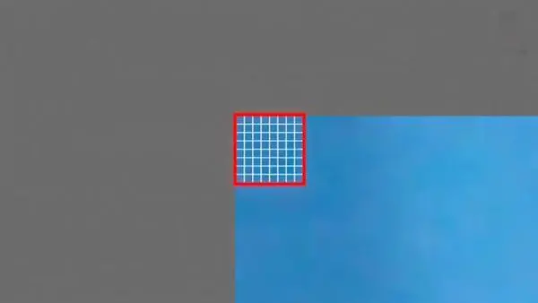

划分好宏块后，计算宏块的象素值。

以此类推，计算一幅图像中每个宏块的像素值，所有宏块都处理完后如下面的样子。

### 划分子块

H264对比较平坦的图像使用 16X16 大小的宏块。但为了更高的压缩率，还可以在 16X16 的宏块上更划分出更小的子块。子块的大小可以是 8X16､ 16X8､ 8X8､ 4X8､ 8X4､ 4X4非常的灵活。

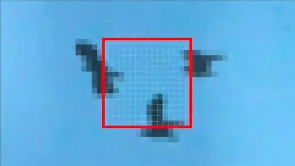

上幅图中，红框内的 16X16 宏块中大部分是蓝色背景，而三只鹰的部分图像被划在了该宏块内，为了更好的处理三只鹰的部分图像，H264就在 16X16 的宏块内又划分出了多个子块。

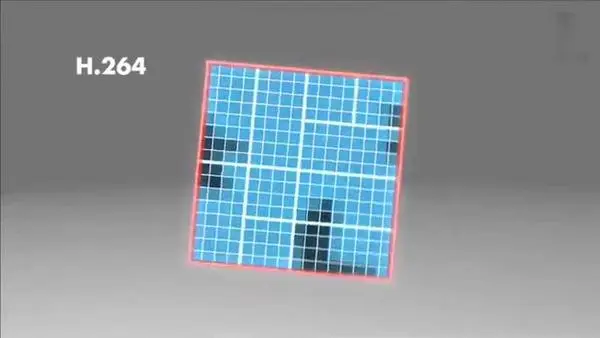

这样再经过帧内压缩，可以得到更高效的数据。下图是分别使用mpeg-2和H264对上面宏块进行压缩后的结果。其中左半部分为MPEG-2子块划分后压缩的结果，右半部分为H264的子块划压缩后的结果，可以看出H264的划分方法更具优势。

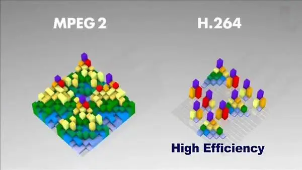

宏块划分好后，就可以对H264编码器缓存中的所有图片进行分组了。

### 帧分组

对于视频数据主要有两类数据冗余，一类是时间上的数据冗余，另一类是空间上的数据冗余。其中时间上的数据冗余是最大的。下面我们就先来说说视频数据时间上的冗余问题。

为什么说时间上的冗余是最大的呢？假设摄像头每秒抓取30帧，这30帧的数据大部分情况下都是相关联的。也有可能不止30帧的的数据，可能几十帧，上百帧的数据都是关联特别密切的。

对于这些关联特别密切的帧，其实我们只需要保存一帧的数据，其它帧都可以通过这一帧再按某种规则预测出来，所以说视频数据在时间上的冗余是最多的。

为了达到相关帧通过预测的方法来压缩数据，就需要将视频帧进行分组。那么如何判定某些帧关系密切，可以划为一组呢？我们来看一下例子，下面是捕获的一组运动的台球的视频帧，台球从右上角滚到了左下角。

H264编码器会按顺序，每次取出两幅相邻的帧进行宏块比较，计算两帧的相似度。如下图：

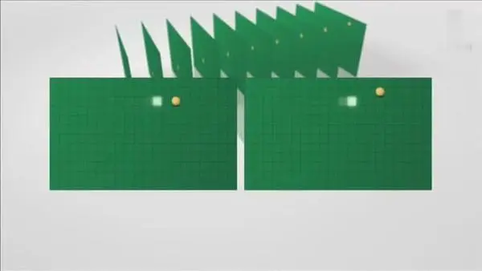

通过宏块扫描与宏块搜索可以发现这两个帧的关联度是非常高的。进而发现这一组帧的关联度都是非常高的。因此，上面这几帧就可以划分为一组。其算法是：在相邻几幅图像画面中，一般有差别的像素只有10%以内的点,亮度差值变化不超过2%，而色度差值的变化只有1%以内，我们认为这样的图可以分到一组。

在这样一组帧中，经过编码后，我们只保留第一帖的完整数据，其它帧都通过参考上一帧计算出来。我们称第一帧为IDR／I帧，其它帧我们称为P／B帧，这样编码后的数据帧组我们称为GOP。

### 运动估计与补偿

在H264编码器中将帧分组后，就要计算帧组内物体的运动矢量了。还以上面运动的台球视频帧为例，我们来看一下它是如何计算运动矢量的。

H264编码器首先按顺序从缓冲区头部取出两帧视频数据，然后进行宏块扫描。当发现其中一幅图片中有物体时，就在另一幅图的邻近位置（搜索窗口中）进行搜索。如果此时在另一幅图中找到该物体，那么就可以计算出物体的运动矢量了。下面这幅图就是搜索后的台球移动的位置。

通过上图中台球位置相差，就可以计算出台图运行的方向和距离。H264依次把每一帧中球移动的距离和方向都记录下来就成了下面的样子。

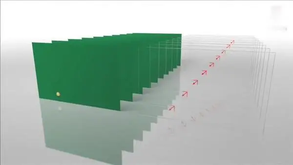

运动矢量计算出来后，将相同部分（也就是绿色部分）减去，就得到了补偿数据。我们最终只需要将补偿数据进行压缩保存，以后在解码时就可以恢复原图了。压缩补偿后的数据只需要记录很少的一点数据。如下所示：

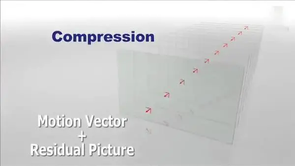

我们把运动矢量与补偿称为帧间压缩技术，它解决的是视频帧在时间上的数据冗余。除了帧间压缩，帧内也要进行数据压缩，帧内数据压缩解决的是空间上的数据冗余。下面我们就来介绍一下帧内压缩技术。

### 帧内预测

人眼对图象都有一个识别度，对低频的亮度很敏感，对高频的亮度不太敏感。所以基于一些研究，可以将一幅图像中人眼不敏感的数据去除掉。这样就提出了帧内预测技术。

H264的帧内压缩与JPEG很相似。一幅图像被划分好宏块后，对每个宏块可以进行 9 种模式的预测。找出与原图最接近的一种预测模式。

下面这幅图是对整幅图中的每个宏块进行预测的过程。

帧内预测后的图像与原始图像的对比如下：

然后，将原始图像与帧内预测后的图像相减得残差值。

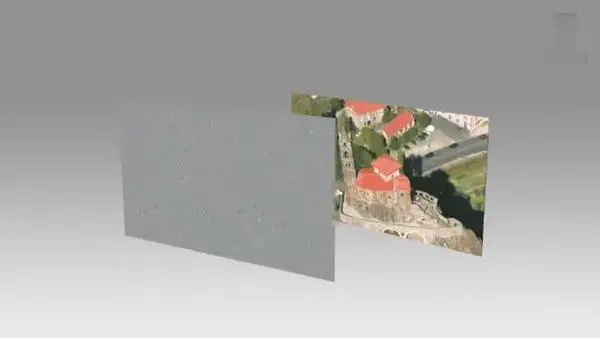

再将我们之前得到的预测模式信息一起保存起来，这样我们就可以在解码时恢复原图了。效果如下：

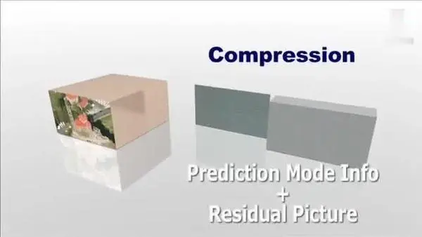

经过帧内与帧间的压缩后，虽然数据有大幅减少，但还有优化的空间。

### 对残差数据做DCT

可以将残差数据做整数离散余弦变换，去掉数据的相关性，进一步压缩数据。如下图所示，左侧为原数据的宏块，右侧为计算出的残差数据的宏块。

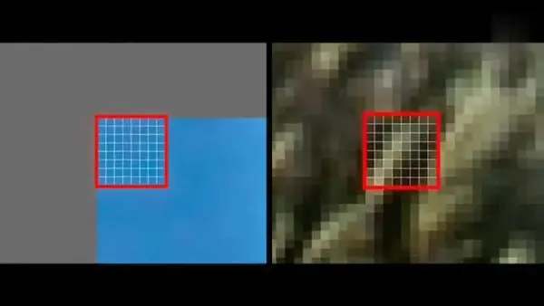

将残差数据宏块数字化后如下图所示：

将残差数据宏块进行 DCT 转换。

去掉相关联的数据后，我们可以看出数据被进一步压缩了。

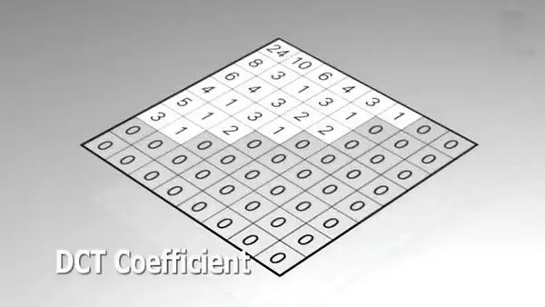

做完 DCT 后，还不够，还要进行 CABAC 进行无损压缩。

### CABAC

上面的帧内压缩是属于有损压缩技术。也就是说图像被压缩后，无法完全复原。而CABAC属于无损压缩技术。

无损压缩技术大家最熟悉的可能就是哈夫曼编码了，给高频的词一个短码，给低频词一个长码从而达到数据压缩的目的。MPEG-2中使用的VLC就是这种算法，我们以 A-Z 作为例子，A属于高频数据，Z属于低频数据。看看它是如何做的。

CABAC也是给高频数据短码，给低频数据长码。同时还会根据上下文相关性进行压缩，这种方式又比VLC高效很多。其效果如下：

现在将 A-Z 换成视频帧，它就成了下面的样子。

从上面这张图中明显可以看出采用 CACBA 的无损压缩方案要比 VLC 高效的多。

## 小结

至此，我们就将H264的编码原理讲完了。本篇文章主要讲了以下以点内容：
1. 简音介绍了H264中的一些基本概念。如I/P/B帧， GOP。
2. 详细讲解了H264编码的基本原理，包括：
    - 宏块的划分
    - 图像分组
    - 帧内压缩技术原理
    - 帧间压缩技术原理。
    - DCT
    - CABAC压缩原理。

希望以上内容能对您有所帮助。谢谢！

 

**原文地址：**

[H264基本原理](https://zhuanlan.zhihu.com/p/31056455)