在流媒体传输领域，经常使用的传输协议是RTP/RTCP，本文将对RTP对H264进行封装的过程进行详解

## 1 H264基本概念

H264是一种视频压缩的标准，与H265、SVAC等压缩方式一样，主要目的是对视频流进行压缩，以便减少网络传输对网络带宽的占用，H264压缩后的帧类型分为I帧/P帧/B帧。

这里解释下帧类型：

**I帧**，为关键帧，采用帧内压缩技术，通过H264压缩算法解对完整帧数据进行压缩，因此I帧不依赖其前后帧数据，直接可以解压成raw数据

**P帧**，为向前参考帧，对raw帧压缩时，需要参考前面的I帧或P帧，采用帧间压缩技术，因此P帧解码不能单独解析，需要依赖前面的帧数据，如果其前面帧有丢失，会导致花屏。

**B帧**，为双向参考帧，对raw进行压缩时既参考前面的帧，又参考他后面的帧，采用帧间压缩技术，因此其解码是需要前面帧及后面帧同时参与。

在baseline编码规格下，无B帧，在main profile规格下一般有B帧，通常来说B帧参与编码会提高压缩率，降低帧大小，但是会增加编解码复杂性。

H264编码后的码流又NAL（网络抽象层）和VCL（视频编码层）构成，VCL数据传输或者存储之前，会被映射到一个NALU中，H264数据包含一个个的NALU，H.264的编码帧序列包括一系列的NAL单元，每个NAL单元包含一个RBSP，单元的信息头定义了RBSP单元的类型，NAL单元其余部分为RBSP数据，这里对NALU头字节进行i二少，因为RTP封装方式，主要针对NALU头进行处理。

## 2 NALU Header介绍

NALU头前通常包含一个 StartCode，StartCode 必须是 0x00000001 或者 0x000001，紧接着就是一个字节的nalu header，nalu header格式如下：

<div style="text-align: center">
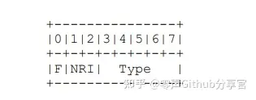
</div>

这里注意上面的0~7b不是字节内位的高低，只是表示占了多少位，从左到右顺序才表示从高位到低位，其详解如下：

**F**：forbidden_zero_bit，H264 规范要求该位为 0，占1位，其所在字节的最高位（第7位）

**NRI**：nal_ref_idc，取值 03，占2位，其在字节的56位，指示该 NALU 重要性，对于 NRI=0的NALU 解码器可以丢弃它而不影响解码，该值越大说明NALU越重要。如果当前NALU属于参考帧的数据，或者是序列参数集，图像参数集等重要信息，则该值必须大于0

**Type**：NALU 数据类型,占5 位，其在字节的0~4位，取值 0 ~ 31

有关Type在H264码流中的常用取值如下：

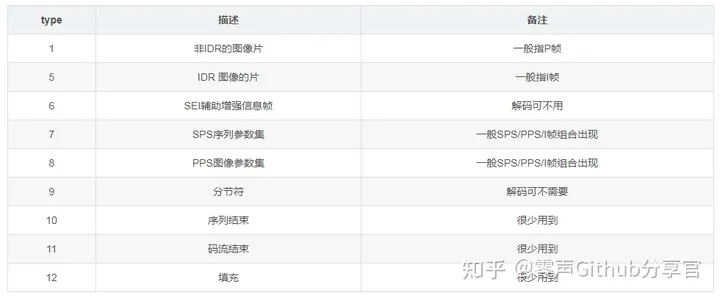

以下是截取的H264视频流的二进制数据，结合此二进制数据，我们来分析下其帧类型

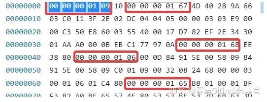

0000000109，其中00000001是帧起始位标识，09是nalu header，二进制为00001001，F(7位）为0标识非禁止，NRI（56位）为0标识可丢弃帧，type（04位）为9，表示分隔符，此帧可丢弃，表示分隔符

0000000167，同上面的分析，NALU头为67，二进制为01100111，F=0，NRI=3，type=7，帧类型为SPS帧，非常重要不可丢弃

0000000168，NALU头为68，二进制为01101000，F=0，NRI=3，type=8，帧类型为PPS帧，非常重要不可丢弃

0000000106，NALU头为06，二进制为00000110，F=0，NRI=0，type=6，帧类型为SEI，可丢弃

0000000165，NALU头为65，二进制为01100101，F=0，NRI=3，type=5，帧类型为I帧，非常重要不可丢弃

从上上面的分析可以看出，IDR（SPS/PPS/I)帧通常一起出现，极少数编码单独出现I帧，但是IDR与I帧单独出现也符合规范。

如下为P帧的帧头，可按照上述方式进行解析。

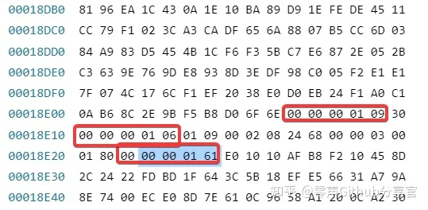

## 3 RTP封装H264码流

由于H264帧大小差别较大，较小的帧小于MTU，则可单包直接发送，或者多帧组合发送，较大的帧大于MTU需要分片发送，RTP发送H264模式主要有三种：单一NALU模式、组合帧封装模式、分片封装模式，有关组合帧封包和分片封包类型包含好几种，这里介绍常用的两种：STAP-A和FU-A。

这里把RTP头格式先贴出来，具体参数详解看下RFC-3984，后面说明用到

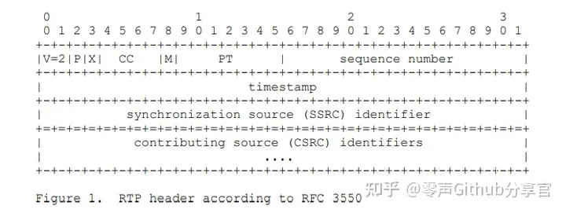

### 3.1 单一NALU模式

此模式一个RTP包包含一个完整的视频帧，RTP头部之后的一个字节为 NALU Header，之后是NALU数据部分，此视频帧大小需要小于MTU，可以单帧通过网络发送，其RTP封装格式如下：


以SPS为例，SPS一般小于MTU，可采用单NALU封装模式，其封包后的二进制如下：

80 e0 be 8e 8c e8 56 d5 4a 9b 57 b3 67 64 00 29 ad 84 05 45 62 b8 ac 54 74 20 2a 2b 15 c5 62 a3 a1 01 51 58 ae 2b 15 1d 08 0a 8a c5 71 58 a8 e8 40 54 56 2b 8a c5 47 42 02 a2 b1 5c 56 2a 3a 10 24 85 21 39 3c 9f 27 e4 fe 4f c9 f2 79 b9 b3 4d 08 12 42 90 9c 9e 4f 93 f2 7f 27 e4 f9 3c dc d9 a6 b4 03 c0 11 3f 2c a9 00 00 03 00 78 00 00 15 90 60 40 00 3e 80 00 00 11 94 06 f7 be 17 84 42 35

其中80 e0 be 8e 8c e8 56 d5 4a 9b 57 b3为RTP头，按照RTP协议格式解析如下：V=10B=2,Padding=0,Extension=0,CC=0,Mark=1,PT=96,SN=48782,TS=2364036821,SSRC=0x4a9b57b3

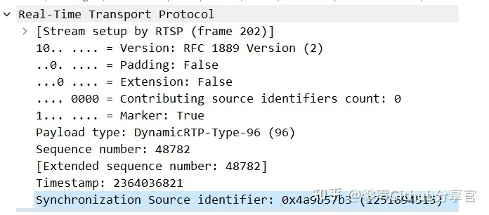

RTP头之后一个字节为NALU头，就是SPS帧去掉00000001起始位标识，为67，之后为NALU单元RBSP数据，在编码是简单的做法就是RTP头后直接附加去除起始标识的NALU数据即可。

### 3.2 组合帧封装模式

此模式是针对多个较小的帧，采用组合成一个RTP包发送的方式，此种方式在H264视频传输中较少使用，一般较小的帧都是通过单一NALU模式发送，此处以STAP-A组合类型为例，组合发送SPS和PPS

组合封包模式格式如下：

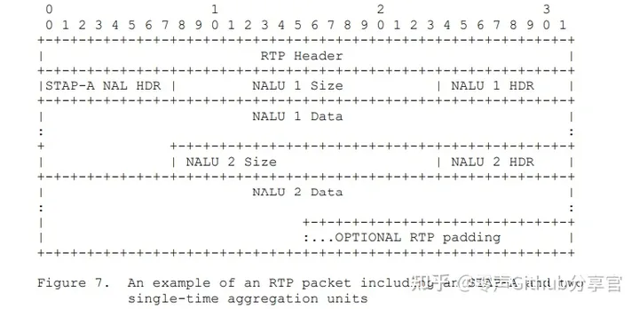

假设SPS和PPS的裸流如下：

**SPS**:  
00 00 00 01 67 64 00 29 ad 84 05 45 62 b8 ac 54 74 20 2a 2b 15 c5 62 a3 a1 01 51 58 ae 2b 15 1d 08 0a 8a c5 71 58 a8 e8 40 54 56 2b 8a c5 47 42 02 a2 b1 5c 56 2a 3a 10 24 85 21 39 3c 9f 27 e4 fe 4f c9 f2 79 b9 b3 4d 08 12 42 90 9c 9e 4f 93 f2 7f 27 e4 f9 3c dc d9 a6 b4 03 c0 11 3f 2c a9 00 00 03 00 78 00 00 15 90 60 40 00 3e 80 00 00 11 94 06 f7 be 17 84 42 35  
**PPS**:  
00 00 00 01 68 33 3c b0 00 00

SPS和PPS组合帧封包后如下：

SPS去掉起始标志，size为117，十六进制为0x75;PPS去掉起始标志，size为0x06

[RTP header 12字节][78 00 75 67 64 00 29 ad 84 05 45 62 b8 ac 54 74 20 2a 2b 15 c5 62 a3 a1 01 51 58 ae 2b 15 1d 08 0a 8a c5 71 58 a8 e8 40 54 56 2b 8a c5 47 42 02 a2 b1 5c 56 2a 3a 10 24 85 21 39 3c 9f 27 e4 fe 4f c9 f2 79 b9 b3 4d 08 12 42 90 9c 9e 4f 93 f2 7f 27 e4 f9 3c dc d9 a6 b4 03 c0 11 3f 2c a9 00 00 03 00 78 00 00 15 90 60 40 00 3e 80 00 00 11 94 06 f7 be 17 84 42 35 00 06  68 33 3c b0 00 00]

其中：

78 STAP-A类型头，其中F为0 NRI为3，type为24，24标识STAP-A类型，此类型标识后续负载为组合帧

00 75 表示SPS的size，后面跟的0x75个自己为去掉起始标志的SPS数据

00 06 表示PPS的size，后面跟的6个字节为去掉起始位的PPS数据

### 3.3 分片封装模式

如果视频帧大小超过MTU，则RTP封装需要分片封装，H264较常用的分片模式位FU-A，这里详细说明的是FU-A分片方式，其格式如下：

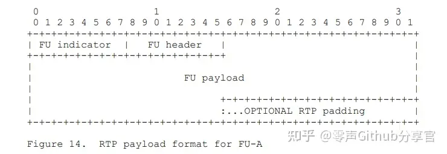

RTP头部之后的第一个字节为 FU indicator，第二个字节为 FU header

FU indicator结构如下所示:

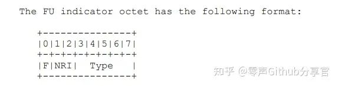

其与nalu header类似，F和NRI取分片的nalu header中对应的F和NRI，Type为分片类型，这里是28，不做详细说明

FU header结构如下：

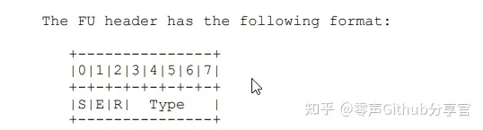

其中

**S**：start标记位，当为1时表示NALU分片的起始分片。

**E**：end标记位，当为1时表示NALU分片的最后一个分片。

**R**：保留位，可忽略。

**Type**：NALU头里的Type类型，等于帧类型

这两个字节之后跟的是NALU的数据，去掉起始位及NALU header之后的数据，按照分片大小进行分包，同一个帧的分片的头两个字节除了起始和结束FU header中的S和E位不同，其他分片这两个自己都一样，这里起始分片要注意去掉H264起始字符和nalu header，通过FU indicator的F/NRI以及FU header即可组合成NALU header，RTP解封装的时候注意生成NALU头及起始标识。

实例如下：

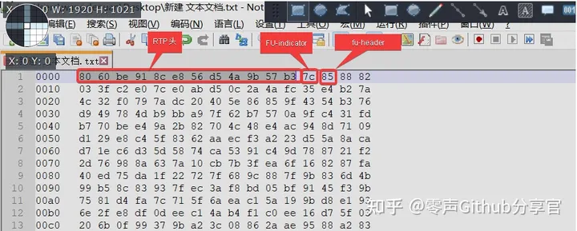

- 0x7c:其二进制为：01111100，F=0，NRI=3，type=28表示FU-A分片，FU indicator
- 0x85:其二进制为：10000101，S=1，E=0,type=5,表示I帧的起始FU-A分片，fu header

其数据通过wireshark解析后如下图：

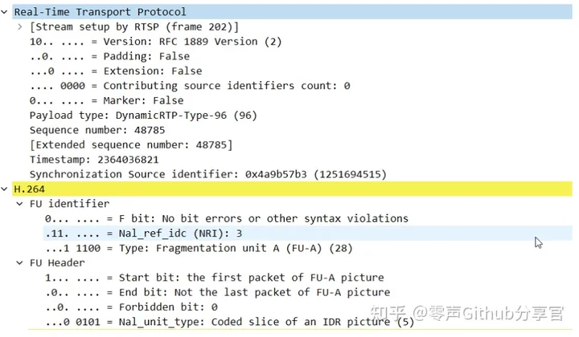

## 4 代码解析

一般H264进行RTP封装，SPS/PPS采用单一NALU封装方式，I帧/P帧采用FU-A分片模式，如果带有SEI及AUD可过滤掉，也可以采用单一NALU封装方式

有关H264采用单一NALU及FU-A分片进行RTP封装发送的相关代码详解，这里引用FFMPEG源码进行解析,这里引用部分打包的代码，解码和这个过程相反

在libavformat/rtpenc_h264_hevc.c中，如下函数对H264及H265（HEVC）打包并发送

```cpp
static void nal_send(AVFormatContext *s1, const uint8_t *buf, int size, int last)
{
    RTPMuxContext *s = s1->priv_data;
    enum AVCodecID codec = s1->streams[0]->codecpar->codec_id;

    av_log(s1, AV_LOG_DEBUG, "Sending NAL %x of len %d M=%d\n", buf[0] & 0x1F, size, last);
    if (size <= s->max_payload_size) {//判断包大小是否小于等于RTP最大负载长度，一般RTP最大负载长度+RTP头小于MTU
        ...
            flush_buffered(s1, 0);
            ff_rtp_send_data(s1, buf, size, last);//这里调用此函数直接发送，ff_rtp_send_data中会对数据直接打RTP头后直接发送，
                                                  //这里由于小于MTU，所以采用单一帧发送模式
        ...
    } else {//视频帧长度大于MTU时，采用FU分片
        ...
        if (codec == AV_CODEC_ID_H264) {//只对H264进行注释，H265后续在说
            uint8_t type = buf[0] & 0x1F;//这里buf已经去掉起始标识00000001，buf[0]标识nalu header，这里取0~4位，即帧类型
            uint8_t nri = buf[0] & 0x60;//这里取5-6位，即：NRI，这里只是通过按位与的方式，保留了5-6位，并未真正转换为真实值，方面后买你组合
            //FU indicator字节
            s->buf[0] = 28;        /* FU Indicator; Type = 28 ---> FU-A */
            s->buf[0] |= nri; //因为nri只是保留了5-6位，这里直接按位或，即可组成fu-indicator
            // fu header
            s->buf[1] = type; //0~4帧类型
            s->buf[1] |= 1 << 7; //最高位起始位为1标识开始
            buf  += 1; //原始H264起始分片需要去掉nalu heder字节，这里直接跳过帧头
            size -= 1; //去掉头字节后，size要减去1

            flag_byte   = 1;
            header_size = 2;//fu-a 头长度
        } else {
            ...
        }

        while (size + header_size > s->max_payload_size) {
            memcpy(&s->buf[header_size], buf, s->max_payload_size - header_size);//发送缓冲buf中已经有了FU-A的2个头字节
            ff_rtp_send_data(s1, s->buf, s->max_payload_size, 0);//发送分片
            buf  += s->max_payload_size - header_size;//h264码流指针移动到未发送的起始位置
            size -= s->max_payload_size - header_size;//未发送的码流数据
            s->buf[flag_byte] &= ~(1 << 7);//更改fu-header，中间分片为00
        }
        s->buf[flag_byte] |= 1 << 6;//更改fu-header，最后一个分片，结束标志值为1
        memcpy(&s->buf[header_size], buf, size);
        ff_rtp_send_data(s1, s->buf, size + header_size, last);//打RTP头并发送
    }
}
```

<br/>

**原文地址：**

[H264码流RTP封装方式详解](https://zhuanlan.zhihu.com/p/559884142)