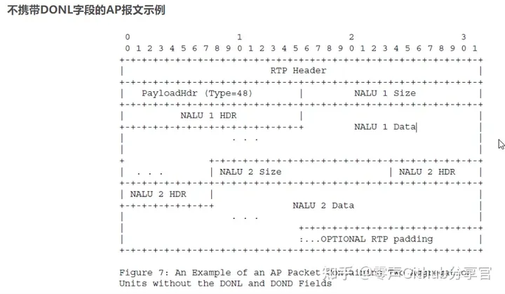

> 近年来，H265作为新的视频编码标准，应用越来越广发，相较于H264，其在高压缩率、高鲁棒性和错误恢复能力、低延时等方面有很更好的表现，因此H265（HEVC）也在越来越多的场景下逐步替代H264。

## 1 H265编码方式介绍

有关H265编码知识不做详细描述，这里主要介绍和RTP相关的知识，主要指NALU头部解析及类型介绍。

H265 NALU头部格式如下：


与h264的nal层相比，h265的nal unit header有两个字节构成,从图中可以看出hHEVC的nal包结构与h264有明显的不同，hevc加入了nal所在的时间层的ＩＤ，去除了nal_ref_idc，字段解释如下：

F:禁止位，1bit(最高位：15位),必须是0，为1标识无效帧

Type: 帧类型，6bits(9~14位)，0-31是vcl nal单元；32-63，是非vcl nal单元，VCL是指携带编码数据的数据流，而non-VCL则是控制数据流。

其类型枚举如下：


LayerID：6 bits，表示NAL所在的Access unit所属的层，该字段是为了HEVC的继续扩展设置，一般为0

TID：3bits，一般为1，此字段指定nal单元加1的时间标识符。时间id的值等于tid-1，tid的值为0是非法的，以确保nal单元报头中至少只有一个比特等于1，以便能够在nal单元头和nal单元有效负载数据中独立考虑启动代码仿真。

通常情况下F为0，layerid为0,TID为1。

H265帧类型与H264不一样，其位置在第一个字节的1~6位(buf[0]&0x7E>>1)，起始标识位00000001；常见的NALU类型：

40 01，type=32,VPS(视频参数集)

42 01，type=33,SPS(序列参数集)

44 01，type=34,PPS(图像参数及)

4E 01, type=39,SEI(补充增强信息)

26 01，type=19,可能有RADL图像的IDR图像的SS编码数据 IDR

02 01, type=01,被参考的后置图像，且非TSA、非STSA的SS编码数据

H265码流二进制片段如下：


以下帧类型在性能不足时可以丢弃：HEVC_NAL_TRAIL_N、HEVC_NAL_TSA_N、HEVC_NAL_STSA_N、HEVC_NAL_RADL_N、HEVC_NAL_RASL_N。

VPS、SPS、PPS：三者的结构和关系如下图所示：


## 2 H265码流RTP封装方式

其中RTP对H265裸流封装，与H264类似，分为单一NALU封装模式/组合帧封装模式/分片封装模式，以下分别进行介绍

### 2.1 单一帧封装模式

针对帧大小小于MTU的可采用单独一帧封装到一个RTP包中，封装格式如下：


其中PayloadHeader一般与NALU Header定义完全一致，DONL：Decoding Order Number。当使用多slice编码模式时使用，用于判断一帧的每个slice是否收齐，一般使用单slice，无此字段，所以通常境况下，单一帧模式封装方式与H264一致，H265帧去掉起始位直接作为负载，这里不做过多接收。

一些是截取的H265单一帧封装的RTP二进制数据：


从type中可以此帧为VPS采用rtp单一封装模式

### 2.2 组合帧封装方式

当帧较小，且多个帧合并后小于MTU的情况，可以多帧组合封装到一个RTP包中，比如（VPS/SPS/PPS)合并封装，注意多帧合并后大小必须小于MTU，不然会被IP分片，其格式如下：


PayloadHeader 负载头，与H264 NALUheader类似，有F，TYPE,LayerID,TID组成，一般F=0，LayerID=0，TID=1，这里Type必须为48，标识组合包头



不带DONL的组合包封装模式与H264类似，这里不做多说，一般情况下很少用到组合帧封装方式，小于MTU的帧一般是单一帧封装，减少解封装复杂性。

### 2.3 分片封装模式

当视频帧大于MTU，需要对帧进行分包发送，从而避免IP层分片，这里采用FU分片模式，格式如下：


这里PayloadHeader中F=0，LayerID=0，TID=1，Type必须为49表示FU分片

FU header定义与FU-A定义基本一致，由于NALU Type在H265中为6bits表示，所以这里去掉了R，只保留S/E/TYPE格式如下：


* S：1bit,1-表示是首个分片报文,0-非首个分片报文
* E：1bit,1-表示最后一个分片报文,0-非最后一个分片报文
* FuType：6 bits,对应的NALU type

分片封包后的实例如下：


payload header：0x6201,按照格式解析后，TID=01，LayID=0,type=49,F=0，表示FU分片

FU header:0x93,按照格式解析后，S=1,E=0,Futype=19，表示IDR_W_RADL

## 3 代码片段解析

有关H265采用单一NALU及FU-A分片进行RTP封装发送的相关代码详解，这里引用FFMPEG源码进行解析,这里引用部分打包的代码，解码和这个过程相反

在libavformat/rtpenc_h264_hevc.c中，如下函数对H264及H265（HEVC）打包并发送

```cpp
static void nal_send(AVFormatContext *s1, const uint8_t *buf, int size, int last)
{
   ...
    if (size <= s->max_payload_size) {//单一帧封装模式
        int buffered_size = s->buf_ptr - s->buf;
        int header_size;
        int skip_aggregate = 0;

        if (codec == AV_CODEC_ID_H264) {
           ...
        } else {
            header_size = 2;//payloadheader的占用字节数，H265为两个字节，与NALU header一样
        }

       ...
            flush_buffered(s1, 0);
            ff_rtp_send_data(s1, buf, size, last);//这里调用此函数直接发送，ff_rtp_send_data中会对数据直接打RTP头后直接发送，与H264类似
        }
    } else {
       ...
        if (codec == AV_CODEC_ID_H264) {
          ...
        } else {
            uint8_t nal_type = (buf[0] >> 1) & 0x3F;//获取NALU type
            /*
             * create the HEVC payload header and transmit the buffer as fragmentation units (FU)
             *
             *    0                   1
             *    0 1 2 3 4 5 6 7 8 9 0 1 2 3 4 5
             *   +-+-+-+-+-+-+-+-+-+-+-+-+-+-+-+-+
             *   |F|   Type    |  LayerId  | TID |
             *   +-------------+-----------------+
             *
             *      F       = 0
             *      Type    = 49 (fragmentation unit (FU))
             *      LayerId = 0
             *      TID     = 1
             */
             //以下两个自己是payloadheader，type=49
            s->buf[0] = 49 << 1;
            s->buf[1] = 1;

            /*
             *     create the FU header
             *
             *     0 1 2 3 4 5 6 7
             *    +-+-+-+-+-+-+-+-+
             *    |S|E|  FuType   |
             *    +---------------+
             *
             *       S       = variable
             *       E       = variable
             *       FuType  = NAL unit type
             */
            s->buf[2]  = nal_type;//fu header的type就是nalu type
            /* set the S bit: mark as start fragment */
            s->buf[2] |= 1 << 7;//第一片，S=1

            /* pass the original NAL header */
            buf  += 2;//去掉nalu header的2个字节
            size -= 2;//去掉nalu header的2个字节，帧长度-2

            flag_byte   = 2;//单帧分片过程中只有fu-header中的s和e会变化，这里是其数组下标
            header_size = 3;//payloadheader+fuheader长度
        }

        while (size + header_size > s->max_payload_size) {
            memcpy(&s->buf[header_size], buf, s->max_payload_size - header_size);//发送缓冲buf中已经有了FU的3个头字节
            ff_rtp_send_data(s1, s->buf, s->max_payload_size, 0);//加上rtp头发送
            buf  += s->max_payload_size - header_size;
            size -= s->max_payload_size - header_size;
            s->buf[flag_byte] &= ~(1 << 7);//更改fu-header 中间分片，s=0 e=0
        }
        s->buf[flag_byte] |= 1 << 6;//最后一个分片，s=0,e=1
        memcpy(&s->buf[header_size], buf, size);
        ff_rtp_send_data(s1, s->buf, size + header_size, last);//发送最后一个分片
    }
}
```


<br/>

**原文地址：**

[H265码流RTP封装方式详解](https://zhuanlan.zhihu.com/p/559895845)